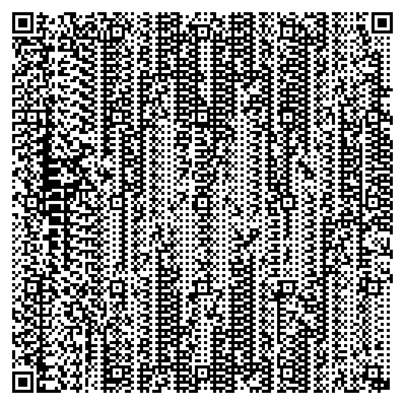

## Web_Tunnel [WEB 260]

>I was just going to search some random cat videos on a Saturday morning when my friend came up to me and told me to reach the end of this tunnel. Can you do it for me?
>http://tunnel.web.easyctf.com/

### EN / [PL](#rozwiązanie)

### Solution:

After entering the site there is a link that is an entry to the tunnel :-)
After clicking, we go to the site http://tunnel.web.easyctf.com/images/DaicO7460493nYSuvLPW.png, where was the picture with the qr code:



Python has a nice library for such purposes - `qrtools`.

```
>>> import qrtools
>>> qr = qrtools.QR()
>>> qr.decode('DaicO7460493nYSuvLPW.png')
True
>>> print qr.data
bl9BimiQOpw99yAYFbbD
```

So we get some string... Moment of consternation and... on site http://tunnel.web.easyctf.com/images/bl9BimiQOpw99yAYFbbD.png was another qr code.
So the tunnel consists of an unknown number of qr codes, each leading to another.

Script automating task:

```python
import qrtools
import requests

URL = 'http://tunnel.web.easyctf.com/images/'
TEMP_IMG = 'temp.png'
qrcode = 'DaicO7460493nYSuvLPW'

counter = 1
while True:
    print str(counter) + '    ' + qrcode
    counter += 1
    
    resp = requests.get(URL + qrcode + '.png')
    
    with open(TEMP_IMG, 'wb') as f:
        f.write(resp.content)
    
    qr = qrtools.QR()
    qr.decode(TEMP_IMG)
    qrcode = qr.data
```

[log](log) from script work.

Finally, the flag waits: `easyctf{y0u_sh0uld_b3_t1r3d_tr4v3ll1ng_all_th1s_w4y!!!!!}`

### [EN](#solution) / PL

### Rozwiązanie:

Po wejściu na stronę pojawia się napis zachęcający do wejścia do tunelu :-)
Po kliknięciu przechodzimy na stronę http://tunnel.web.easyctf.com/images/DaicO7460493nYSuvLPW.png, gdzie znajdował się obrazek z kodem qr:


Python ma fajną bibliotekę do takich celów - `qrtools`.

```
>>> import qrtools
>>> qr = qrtools.QR()
>>> qr.decode('DaicO7460493nYSuvLPW.png')
True
>>> print qr.data
bl9BimiQOpw99yAYFbbD
```

A więc dostajemy jakiś string... Chwila konsternacji i... na stronie http://tunnel.web.easyctf.com/images/bl9BimiQOpw99yAYFbbD.png czekał kolejny kod qr.
Zatem tunel złożony jest z niewiadomej ilości kodów qr, z których każdy prowadzi do kolejnego.

Skrypt automatyzujący zadanie:

```python
import qrtools
import requests

URL = 'http://tunnel.web.easyctf.com/images/'
TEMP_IMG = 'temp.png'
qrcode = 'DaicO7460493nYSuvLPW'

counter = 1
while True:
    print str(counter) + '    ' + qrcode
    counter += 1
    
    resp = requests.get(URL + qrcode + '.png')
    
    with open(TEMP_IMG, 'wb') as f:
        f.write(resp.content)
    
    qr = qrtools.QR()
    qr.decode(TEMP_IMG)
    qrcode = qr.data
```

[log](log) z działania skryptu.

Na końcu czeka flaga: `easyctf{y0u_sh0uld_b3_t1r3d_tr4v3ll1ng_all_th1s_w4y!!!!!}`
