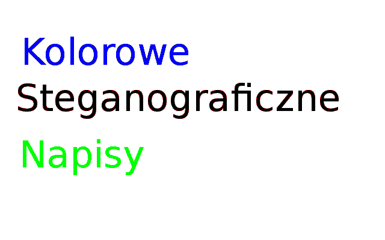

## misja005

>Jeden z naszych agentów dostał się wczoraj w nocy do silnie strzeżonej placówki<br>
>dyplomatycznej i zrobił zdjęcie kartki z hasłem do jednego z ich serwerów.<br>
>Fotografię otrzymaliśmy nieco po północy, ale wygląda na to, że jest uszkodzone.
>
>  http://gynvael.vexillium.org/ext/m5_tajne.png
>
>Przeanalizuj powyższą fotografię i spróbuj odzyskać wykradzione hasło.

### Rozwiązanie:

Po pobraniu obrazka krótka pythonowa sesja w terminalu:

```
>>> from PIL import Image
>>> img = Image.open('m5_tajne.png')
>>> pixels = img.load()
>>> pixels[0,0]
7
>>> pixels[200,100]
3
>>> from collections import Counter
>>> p = [pixels[i, j] for i in range(640) for j in range(400)]
>>> c = Counter(p)
>>> c
Counter({7: 239904, 0: 7365, 3: 3855, 2: 3211, 1: 606, 5: 533, 4: 295, 6: 231})
```

Można zauważyć, że piksele mają dziwne wartości. Spodziewałem się krotki rgb, np. `(0, 0, 0)` dla czarnego, `(255, 255, 255)` dla białego, zamiast tego wartościami były cyfry z zakresu `[0, 7]`.

Widać też, że najwięcej jest pikseli z wartością `7` - to prawdopodobnie tło.

Spróbowałem po prostu przypisać odpowiednim wartościom jakieś kolory i zobaczyć co się stanie :-)

```python
from PIL import Image

COLORS = {0: (0, 0, 0),
          1: (255, 0, 0),
          2: (0, 255, 0),
          3: (0, 0, 255),
          4: (80, 80, 80),
          5: (150, 150, 150),
          6: (200, 200, 200),
          7: (255, 255, 255)}

img = Image.open('m5_tajne.png')
pix = img.load()
pixels = [COLORS[pix[col, row]] for row in range(400) for col in range(640)]


picture = Image.new("RGB", (640, 400))
picture.putdata(pixels)
picture.save('secret.png')
```

Okazało się, że to wystarczyło do odczytania treści :-)



Hasło to: Kolorowe Steganograficzne Napisy
