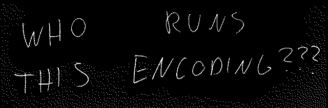

## mission 005

>We've already learned not to rely on "agent Huffman's" ability to send us text<br>
>messages. So this time, we've asked him to take a picture of some secret<br>
>documents and put them on a website. I mean, would could possibly go wrong,<br>
>right?
>
>Well, he sent us this link:
>
>  http://gynvael.vexillium.org/ext/thepicture/
>
>Obviously we can't make heads or tails of it. Please help.
>
>On a totally unrelated note, we're looking for new agents...
>
>GOOD LUCK!

### Solution:

After visiting the given address you will see that the image that should be there is not properly displayed.

At the source of the site you can find a note of agent Huffman:

```
Note: some browsers like Chrome, Firefox, IE, Safair, Edge, etc
might not support this type of HTTP compression and image format.
Actually, I don't think any browser supports it.
It's perfect security!
```

By inspecting the site using Firebug I was able to discover some important details.

header Content-Encoding ---> rle


Moment of googling and as usual on wikipedia I found information about it: [Run-length encoding (RLE)](https://en.wikipedia.org/wiki/Run-length_encoding)

Ok, but now you still have to download this encoded image ;-)

From http://gynvael.vexillium.org/ext/thepicture/ there is redirection to http://gynvael.vexillium.org/ext/thepicture/picture.image


I used python script to download the content:

```python
from urllib import request

host = 'http://gynvael.vexillium.org/ext/thepicture/picture.image'

u = request.urlopen(host)
resp = u.read()
```

It looks like this:

```python
b'\xff\x01\xff\x01\xff\x01\xff\x01\...\x01\x01\x00\x06\x01'
```

And in the form of a list:

```python
[255, 1, 255, 1, 255, 1, 255, 1, ..., 1, 1, 0, 6, 1]
```

Even indices take different values, but odd ones are only `0` or `1`.

I used the python library `pillow` to recreate the image.

And one more important element - in the header we get the dimensions of the picture:

```
Content-Type	image/raw; w=640,h=212,bpp=8
```

The whole script:

```python
from urllib import request
from PIL import Image

host = 'http://gynvael.vexillium.org/ext/thepicture/picture.image'

u = request.urlopen(host)
resp = u.read()
resp = list(resp)

WHITE = (255, 255, 255)
BLACK = (0, 0, 0)

pixels = ''.join([i*str(j) for i, j in zip(resp[::2], resp[1::2])])
pixels = [(WHITE, BLACK)[pixel == '1'] for pixel in pixels]

img = Image.new("RGB", (640, 212))
img.putdata(pixels)
img.save('secret.png')
```

And picture:



WHO RUNS THIS ENCODING ???
