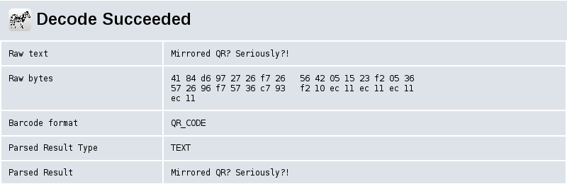

## mission 005

>Finally we hired a new secret agent and moved agent Huffman to do some harmless<br>
>paperwork. That's the good news. The bad news is that agent Huffman made it his<br>
>mission to train our new agent and this went exactly as expected - i.e. we cannot<br>
>decode the report received from the new agent.
>
>Long story short, agent Huffman Junior sent us this file:
>
>  http://goo.gl/S395x6
>
>We don't really know how to decode it, nor do we care at this point. Please take<br>
>a look and decode it if you can.
>
>GOOD LUCK!

### Solution:

On the given page we get a file [mission006.data](mission006.data), which consists of a number of two-element lists containing numbers.

An attempt to analyze the data:

```
$ python3
Python 3.4.2 (default, Oct  8 2014, 10:45:20) 
[GCC 4.9.1] on linux
Type "help", "copyright", "credits" or "license" for more information.
>>> numbers = []
>>> for line in open('mission006.data', 'r'):
...   line = line[1:-2].split(',')
...   numbers += line
... 
>>> numbers = [int(i) for i in numbers[:-1]]
>>> min(numbers)
0
>>> max(numbers)
24
```

As you can see, they are `positive numbers, not exceeding 24`.

```
>>> from collections import Counter
>>> 
>>> data = []
>>> 
>>> for line in open('mission006.data', 'r'):
...   line = line[1:-2].split(',')
...   data.append(tuple(line))
... 
>>> data = data[:-1]
>>> Counter(data).most_common(1)
[(('16', ' 12'), 1)]
```

You can see that all two-element lists are unique (no two are the same).

And since so and considering the size of the data is not too big, I thought it would not hurt to make a small visualization and see what would come out of it. :-)

```
>>> grid = [[' ' for j in range(25)] for i in range(25)]
>>> 
>>> for i,j in data:
...   i, j = int(i), int(j)
...   grid[i][j] = '#'
... 
>>> for row in grid:
...   print(''.join(row))
... 
#######   ##  ## ### ####
#     # ####  ### #  #  #
# ### #   # # # ### # # #
# ### # ###  ## #    ## #
# ### #     #   ######   
#     # ##     ##   # ###
#######  ###### # # ##   
        ## ###  #   # ###
##  # # #### ## #####  # 
 ##  #  # ### # # # #####
 ######### ## # ## # ### 
## #    # # ##  ##  ### #
 #  # ### #  # ## # ## ##
 ###      ###     ###    
  # ### #  # ####   ## # 
####    ###### # ##   ## 
 # # ## # # #   ### #####
        #     #          
####### # # # # # #######
#     #   ## ###  #     #
# ### # #  ##   # # ### #
# ### # ### ## #  # ### #
# ### # # #   #   # ### #
#     # ######    #     #
####### # #  #### #######
```

This is a `QR code` :-) Just a little incorrect.

```
>>> grid = grid[::-1]
>>> 
>>> for row in grid:
...   print(''.join(row))
... 
####### # #  #### #######
#     # ######    #     #
# ### # # #   #   # ### #
# ### # ### ## #  # ### #
# ### # #  ##   # # ### #
#     #   ## ###  #     #
####### # # # # # #######
        #     #          
 # # ## # # #   ### #####
####    ###### # ##   ## 
  # ### #  # ####   ## # 
 ###      ###     ###    
 #  # ### #  # ## # ## ##
## #    # # ##  ##  ### #
 ######### ## # ## # ### 
 ##  #  # ### # # # #####
##  # # #### ## #####  # 
        ## ###  #   # ###
#######  ###### # # ##   
#     # ##     ##   # ###
# ### #     #   ######   
# ### # ###  ## #    ## #
# ### #   # # # ### # # #
#     # ####  ### #  #  #
#######   ##  ## ### ####
```

Much better.

Now we need to save the QR code to the file.

The whole script:

```python
from PIL import Image


data = []

for line in open('mission006.data', 'r'):
    line = line[1:-2].split(',')
    
    data.append(tuple(line))
    
data = data[:-1]

####################################################

grid = [[' ' for j in range(25)] for i in range(25)]

for i,j in data:
    i, j = int(i), int(j)
    
    grid[i][j] = '#'

grid = grid[::-1]

####################################################

img = Image.new("RGB", (25, 25))

pixels = []

for i in range(25):
    for j in range(25):
        if grid[i][j] == '#':
            pixels.append((0,0,0))
        else:
            pixels.append((255,255,255))

pixels = tuple(pixels)

img.putdata(pixels)
img.save('flag.png')
```

And received `QR code`:


I used the online tool https://zxing.org/w/decode to read the message:



Mirrored QR? Seriously?!
