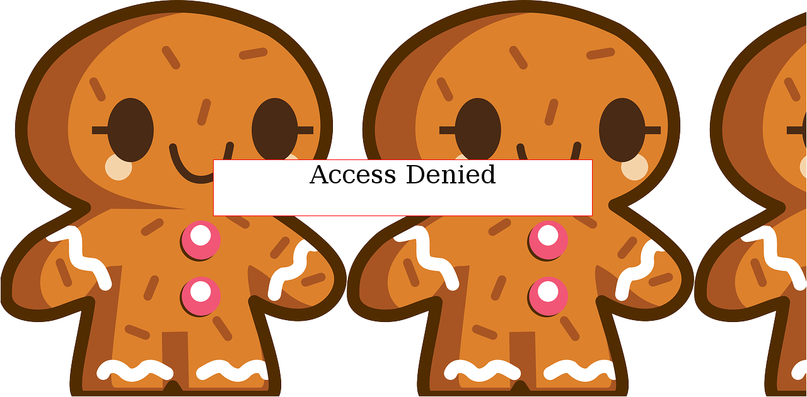

## Biscuit [WEB 75]

>Your friend has a personal website. Fortunately for you, he is a bit of a noob when it comes to hosting a website. Can you find out what he is hiding? Website http://shell2017.picoctf.com:19997/
>
>HINTS
>
>Viewing the source of the website is usually a good start.

### EN / [PL](#rozwiązanie)

### Solution:

When you go to the page you can see that there are not many elements:



Here's the whole source of the page:

```html
<html>

<!-- Storing stuff in the same directory as your web server doesn't seem like a good idea -->
<!-- Thankfully, we use a hidden one that is super PRIVATE, to protect our cookies.sqlite file -->
<style>
body{
	background-image: url("private/image.png");
}
</style>


<body >

<div style='background:white;margin: auto;border: 1px solid red;width: 600px; margin-top: 20%;' >
<center>
<form style="font-size: 40px; ">
Access Denied</form>
</center>
</div>


</body>

</html>
```

You can see that the background image is stored in the `private` directory.

An attempt to review the entire content `http://shell2017.picoctf.com:19997/private/` ends with `Not Found` message.

In the source of the page, the comment shows that in the super private directory is kept `cookies.sqlite` :-)

Once typed in the browser `http://shell2017.picoctf.com:19997/private/cookies.sqlite` we get the mentioned file.

This is a `sqlite` database file that holds the contents of the database.

To view the content I used the `sqlite3` module from the standard Python library:

```python
import sqlite3

conn = sqlite3.connect('cookies.sqlite')

for elem in conn.iterdump():
	print(elem)
```

Result:

```
BEGIN TRANSACTION;
CREATE TABLE moz_cookies (id INTEGER PRIMARY KEY, baseDomain TEXT, appId INTEGER DEFAULT 0, inBrowserElement INTEGER DEFAULT 0, name TEXT, value TEXT, host TEXT, path TEXT, expiry INTEGER, lastAccessed INTEGER, creationTime INTEGER, isSecure INTEGER, isHttpOnly INTEGER, CONSTRAINT moz_uniqueid UNIQUE (name, host, path, appId, inBrowserElement));
INSERT INTO "moz_cookies" VALUES(1,'localhost',0,0,'ID','F3MAqpWxIvESiUNLHsflVd','localhost','/',1489365457,1489279130600290,1489279057101857,0,0);
CREATE INDEX moz_basedomain ON moz_cookies (baseDomain, appId, inBrowserElement);
COMMIT;
```

There is a `moz_cookies` table in the database, with one record containing `'ID', 'F3MAqpWxIvESiUNLHsflVd'`.

After inspecting the page with Firebug you can see that the page generates an 'ID' cookie with an immediate expiration date.
Just change the contents of the cookie to `'F3MAqpWxIvESiUNLHsflVd'` and increase the expiration date, and after the refresh we get the flag :-)


### [EN](#solution) / PL

### Rozwiązanie:

Po wejściu na stronę widać, że nie jest ona zbyt rozbudowana:


Oto całe źródło strony:

```html
<html>

<!-- Storing stuff in the same directory as your web server doesn't seem like a good idea -->
<!-- Thankfully, we use a hidden one that is super PRIVATE, to protect our cookies.sqlite file -->
<style>
body{
	background-image: url("private/image.png");
}
</style>


<body >

<div style='background:white;margin: auto;border: 1px solid red;width: 600px; margin-top: 20%;' >
<center>
<form style="font-size: 40px; ">
Access Denied</form>
</center>
</div>


</body>

</html>
```

Widać, że obrazek z tła jest przechowywany w katalogu `private`.

Próba przejrzenia całej zawartości `http://shell2017.picoctf.com:19997/private/` kończy się komunikatem `Not Found`.

W źródle strony, w komentarzu widać, że w super prywatnym katalogu trzymany jest plik `cookies.sqlite` :-)

Po wpisaniu w przeglądarce `http://shell2017.picoctf.com:19997/private/cookies.sqlite` dostajemy wspomniany plik.

Jest to plik bazy danych `sqlite`, w którym trzymana jest zawartość bazy.

Do obejrzenia zawartości wykorzystałem moduł `sqlite3` z biblioteki standardowej Pythona:

```python
import sqlite3

conn = sqlite3.connect('cookies.sqlite')

for elem in conn.iterdump():
	print(elem)
```

Efekt:

```
BEGIN TRANSACTION;
CREATE TABLE moz_cookies (id INTEGER PRIMARY KEY, baseDomain TEXT, appId INTEGER DEFAULT 0, inBrowserElement INTEGER DEFAULT 0, name TEXT, value TEXT, host TEXT, path TEXT, expiry INTEGER, lastAccessed INTEGER, creationTime INTEGER, isSecure INTEGER, isHttpOnly INTEGER, CONSTRAINT moz_uniqueid UNIQUE (name, host, path, appId, inBrowserElement));
INSERT INTO "moz_cookies" VALUES(1,'localhost',0,0,'ID','F3MAqpWxIvESiUNLHsflVd','localhost','/',1489365457,1489279130600290,1489279057101857,0,0);
CREATE INDEX moz_basedomain ON moz_cookies (baseDomain, appId, inBrowserElement);
COMMIT;
```

W bazie istnieje tabela `moz_cookies`, a w niej jeden rekord zawierający wartości `'ID','F3MAqpWxIvESiUNLHsflVd'`.

Po inspekcji strony za pomocą Firebuga widać, że strona generuje ciasteczko 'ID' z natychmiastową datą wygaśnięcia.
Wystarczy podmienić zawartość ciastka na wartość `'F3MAqpWxIvESiUNLHsflVd'` i zwiększyć datę wygaśnięcia i po odświeżeniu otrzymujemy flagę :-)


