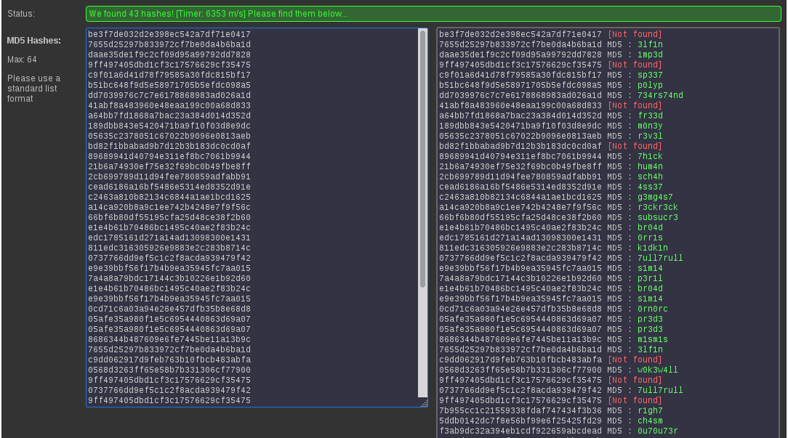

## Leaked_Hashes [CRYPTO 90]

>Someone got hacked! Check out some service's password hashes that were leaked at hashdump.txt! Do you think they chose strong passwords? We should check... The service is running at shell2017.picoctf.com:53397!
HINTS
See if you can crack any of the login credentials and then connect to the service as one of the users. What's the chance these hashes have actually already been broken by someone else? Are there websites that host those cracked hashes? Connect from the shell with nc.

* [hashdump.txt](hashdump.txt)

### EN / [PL](#rozwiązanie)

### Solution:

Extracting the hashes from the file:

```python
for line in open('hashdump.txt'):
	print(line.strip().partition(':')[-1])
```

And then using the site https://hashkiller.co.uk/md5-decrypter.aspx we can easily check if one of them is broken.

It turns out that most of them are already known.



After joining passwords to hash table, we have a list of logins and passwords:

```
root:be3f7de032d2e398ec542a7df71e0417 [Not found]
christene:7655d25297b833972cf7be0da4b6ba1d MD5 : 3lf1n
nadia:daae35de1f9c2cf09d95a99792dd7828 MD5 : 1mp3d
myra:9ff497405dbd1cf3c17576629cf35475 [Not found]
sharell:c9f01a6d41d78f79585a30fdc815bf17 MD5 : sp337
lilli:b51bc648f9d5e58971705b5efdc098a5 MD5 : p0lyp
ilene:dd7039976c7c7e6178868983ad026a1d MD5 : 734rs74nd
emiko:41abf8a483960e48eaa199c00a68d833 [Not found]
lindsey:a64bb7fd1868a7bac23a384d014d352d MD5 : fr33d
deandrea:189dbb843e5420471ba9f10f03d8e9dc MD5 : m0n3y
honey:05635c2378051c67022b9096e0813aeb MD5 : r3v3l
diana:bd82f1bbabad9b7d12b3b183dc0cd0af [Not found]
lucretia:89689941d40794e311ef8bc7061b9944 MD5 : 7h1ck
adelina:21b6a74930ef75e32f69bc0b49fbe8ff MD5 : hum4n
shala:2cb699789d11d94fee780859adfabb91 MD5 : sch4h
jefferson:cead6186a16bf5486e5314ed8352d91e MD5 : 4ss37
leandro:c2463a810b82134c6844a1ae1bcd1625 MD5 : g3mg4s7
lynwood:a14ca920b8a9c1ee742b4248e7f9f56c MD5 : r3ckr3ck
nikia:66bf6b80df55195cfa25d48ce38f2b60 MD5 : subsucr3
rickie:e1e4b61b70486bc1495c40ae2f83b24c MD5 : br04d
kory:edc1785161d271a14ad13098300e1431 MD5 : 0rr1s
cordelia:811edc316305926e9883e2c283b8714c MD5 : k1dk1n
hollie:0737766dd9ef5c1c2f8acda939479f42 MD5 : 7ull7rull
lula:e9e39bbf56f17b4b9ea35945fc7aa015 MD5 : s1m14
sara:7a4a8a79bdc17144c3b10226e1b92d60 MD5 : p3r1l
dede:e1e4b61b70486bc1495c40ae2f83b24c MD5 : br04d
jammie:e9e39bbf56f17b4b9ea35945fc7aa015 MD5 : s1m14
kelvin:0cd71c6a03a94e26e457dfb35b8e68d8 MD5 : 0rn0rc
hildegard:05afe35a980f1e5c6954440863d69a07 MD5 : pr3d3
anabel:05afe35a980f1e5c6954440863d69a07 MD5 : pr3d3
nathalie:8686344b487609e6fe7445be11a13b9c MD5 : m1sm1s
jazmin:7655d25297b833972cf7be0da4b6ba1d MD5 : 3lf1n
clinton:c9dd062917d9feb763b10fbcb483abfa [Not found]
gregg:0568d3263ff65e58b7b331306cf77900 MD5 : w0k3w4ll
sheilah:9ff497405dbd1cf3c17576629cf35475 [Not found]
charity:0737766dd9ef5c1c2f8acda939479f42 MD5 : 7ull7rull
roselyn:9ff497405dbd1cf3c17576629cf35475 [Not found]
denver:7b955cc1c21559338fdaf747434f3b36 MD5 : r1gh7
sonny:5ddb0142dc7f8e56bf99e6f25425fd29 MD5 : ch4sm
theresia:f3ab9dc32a394eb1cdf922659abcdead MD5 : 0u70u73r
patience:6a8cd19a61e34f8ca4e0e7a14bb0e45b MD5 : s4ppy
rita:0568d3263ff65e58b7b331306cf77900 MD5 : w0k3w4ll
karine:d63d5efad4a59c06228d0596a89e2a34 MD5 : 3mb0x
mariann:41abf8a483960e48eaa199c00a68d833 [Not found]
tamela:91f7fceef0044b405d862d132fa667e9 MD5 : dry3x3r7
janett:a14ca920b8a9c1ee742b4248e7f9f56c MD5 : r3ckr3ck
maynard:3f4e535a671209f394817559372286f2 MD5 : d3b17
luann:08a81fafe787c93d02eb338b75f61819 MD5 : d3r7h
beau:3a663354e45f1dbf9702ffa5dc799c2f MD5 : 3l3c7
corrie:ee4d5bc25a2771d95fdbd24452e355ad MD5 : r3s4w
raina:91f7fceef0044b405d862d132fa667e9 MD5 : dry3x3r7
```

Connection to the service, login and among various ascii art there is a flag :-)

```
$ nc shell2017.picoctf.com 53397
enter username:
christene
christene's password:3lf1n
welcome to shady file server. would you like to access the cat ascii art database? y/n
y

     /\_/\ 
    ( o o )
  G-==_Y_==-M
      `-'
      
  /\ /\ 
  (O o)
=(: ^ :)=  
  '*v*'

... 

     /\__/\ 
    /`    '\ 
  === 0  0 ===
    \  --  /    - flag is 53c0bedf15f745eeed4a6c6c30a10f30

   /        \ 
  /          \ 
 |            |
  \  ||  ||  /
   \_oo__oo_/#######o

...   
```

### [EN](#solution) / PL

### Rozwiązanie:

Wyodrębnienie samych hashy z pliku:

```python
for line in open('hashdump.txt'):
	print(line.strip().partition(':')[-1])
```

A potem korzystając ze strony https://hashkiller.co.uk/md5-decrypter.aspx można łatwo sprawdzić czy któryś z nich nie został już przypadkiem złamany.

Okazuje się, że większość z nich jest już znana.


Po dołączeniu haseł do hashy mamy listę loginów i haseł:

```
root:be3f7de032d2e398ec542a7df71e0417 [Not found]
christene:7655d25297b833972cf7be0da4b6ba1d MD5 : 3lf1n
nadia:daae35de1f9c2cf09d95a99792dd7828 MD5 : 1mp3d
myra:9ff497405dbd1cf3c17576629cf35475 [Not found]
sharell:c9f01a6d41d78f79585a30fdc815bf17 MD5 : sp337
lilli:b51bc648f9d5e58971705b5efdc098a5 MD5 : p0lyp
ilene:dd7039976c7c7e6178868983ad026a1d MD5 : 734rs74nd
emiko:41abf8a483960e48eaa199c00a68d833 [Not found]
lindsey:a64bb7fd1868a7bac23a384d014d352d MD5 : fr33d
deandrea:189dbb843e5420471ba9f10f03d8e9dc MD5 : m0n3y
honey:05635c2378051c67022b9096e0813aeb MD5 : r3v3l
diana:bd82f1bbabad9b7d12b3b183dc0cd0af [Not found]
lucretia:89689941d40794e311ef8bc7061b9944 MD5 : 7h1ck
adelina:21b6a74930ef75e32f69bc0b49fbe8ff MD5 : hum4n
shala:2cb699789d11d94fee780859adfabb91 MD5 : sch4h
jefferson:cead6186a16bf5486e5314ed8352d91e MD5 : 4ss37
leandro:c2463a810b82134c6844a1ae1bcd1625 MD5 : g3mg4s7
lynwood:a14ca920b8a9c1ee742b4248e7f9f56c MD5 : r3ckr3ck
nikia:66bf6b80df55195cfa25d48ce38f2b60 MD5 : subsucr3
rickie:e1e4b61b70486bc1495c40ae2f83b24c MD5 : br04d
kory:edc1785161d271a14ad13098300e1431 MD5 : 0rr1s
cordelia:811edc316305926e9883e2c283b8714c MD5 : k1dk1n
hollie:0737766dd9ef5c1c2f8acda939479f42 MD5 : 7ull7rull
lula:e9e39bbf56f17b4b9ea35945fc7aa015 MD5 : s1m14
sara:7a4a8a79bdc17144c3b10226e1b92d60 MD5 : p3r1l
dede:e1e4b61b70486bc1495c40ae2f83b24c MD5 : br04d
jammie:e9e39bbf56f17b4b9ea35945fc7aa015 MD5 : s1m14
kelvin:0cd71c6a03a94e26e457dfb35b8e68d8 MD5 : 0rn0rc
hildegard:05afe35a980f1e5c6954440863d69a07 MD5 : pr3d3
anabel:05afe35a980f1e5c6954440863d69a07 MD5 : pr3d3
nathalie:8686344b487609e6fe7445be11a13b9c MD5 : m1sm1s
jazmin:7655d25297b833972cf7be0da4b6ba1d MD5 : 3lf1n
clinton:c9dd062917d9feb763b10fbcb483abfa [Not found]
gregg:0568d3263ff65e58b7b331306cf77900 MD5 : w0k3w4ll
sheilah:9ff497405dbd1cf3c17576629cf35475 [Not found]
charity:0737766dd9ef5c1c2f8acda939479f42 MD5 : 7ull7rull
roselyn:9ff497405dbd1cf3c17576629cf35475 [Not found]
denver:7b955cc1c21559338fdaf747434f3b36 MD5 : r1gh7
sonny:5ddb0142dc7f8e56bf99e6f25425fd29 MD5 : ch4sm
theresia:f3ab9dc32a394eb1cdf922659abcdead MD5 : 0u70u73r
patience:6a8cd19a61e34f8ca4e0e7a14bb0e45b MD5 : s4ppy
rita:0568d3263ff65e58b7b331306cf77900 MD5 : w0k3w4ll
karine:d63d5efad4a59c06228d0596a89e2a34 MD5 : 3mb0x
mariann:41abf8a483960e48eaa199c00a68d833 [Not found]
tamela:91f7fceef0044b405d862d132fa667e9 MD5 : dry3x3r7
janett:a14ca920b8a9c1ee742b4248e7f9f56c MD5 : r3ckr3ck
maynard:3f4e535a671209f394817559372286f2 MD5 : d3b17
luann:08a81fafe787c93d02eb338b75f61819 MD5 : d3r7h
beau:3a663354e45f1dbf9702ffa5dc799c2f MD5 : 3l3c7
corrie:ee4d5bc25a2771d95fdbd24452e355ad MD5 : r3s4w
raina:91f7fceef0044b405d862d132fa667e9 MD5 : dry3x3r7
```

Połączenie z serwisem, logowanie i pośród różnych ascii artów jest flaga :-)

```
$ nc shell2017.picoctf.com 53397
enter username:
christene
christene's password:3lf1n
welcome to shady file server. would you like to access the cat ascii art database? y/n
y

     /\_/\ 
    ( o o )
  G-==_Y_==-M
      `-'
      
  /\ /\ 
  (O o)
=(: ^ :)=  
  '*v*'

... 

     /\__/\ 
    /`    '\ 
  === 0  0 ===
    \  --  /    - flag is 53c0bedf15f745eeed4a6c6c30a10f30

   /        \ 
  /          \ 
 |            |
  \  ||  ||  /
   \_oo__oo_/#######o

...   
```
