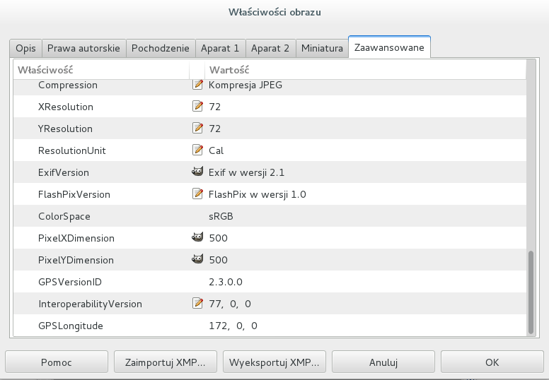

## Meta_Find_Me [FOR 70]

>Find the location of the flag in the image: [image.jpg](image.jpg). Note: Latitude and longitude values are in degrees with no degree symbols,/direction letters, minutes, seconds, or periods. They should only be digits. The flag is not just a set of coordinates - if you think that, keep looking!
>
>HINTS
>
>How can images store location data? Perhaps search for GPS info on photos.


### EN / [PL](#rozwiązanie)

### Solution:

I started looking for the flag from the `strings` command and immediately got the first part of the flag.

```
$ strings image.jpg | grep flag
u"Your flag is flag_2_meta_4_me_<lat>_<lon>_736c. Now find the GPS coordinates of this image! (Degrees only please)"
```

Missing `lat` and `lon` values can be easily found in the image metadata. After opening in `gimp` in properties I found gps data:



```
lat = 77
lon = 172
```

Flag:

```
flag_2_meta_4_me_77_172_736c
```

### [EN](#solution) / PL

### Rozwiązanie:

Poszukiwania flagi rozpocząłem od polecenia `strings` i od razu dostałem pierwszą część flagi.

```
$ strings image.jpg | grep flag
u"Your flag is flag_2_meta_4_me_<lat>_<lon>_736c. Now find the GPS coordinates of this image! (Degrees only please)"
```

Pozostała część, czyli wartości `lat` i `lon` mogą być łatwo odszukane w metadanych obrazka. Po otwarciu w `gimp` we właściwościach znalazłem dane gps:


```
lat = 77
lon = 172
```

Flaga:

```
flag_2_meta_4_me_77_172_736c
```
